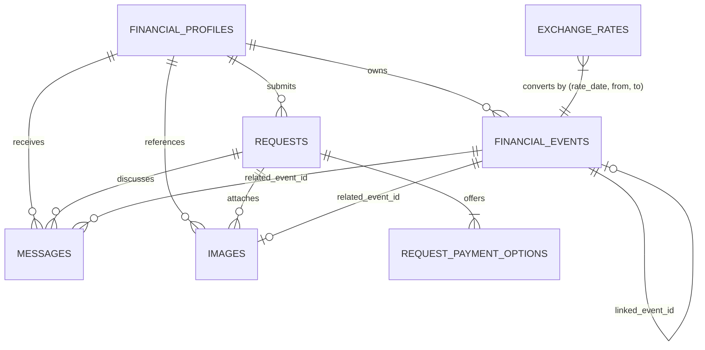

# Buy or Wait? Dataset Analysis

Comprehensive data audit and schema analysis for the HackerRank Orchestrate (September 2026) **"Buy or Wait?"** challenge.

---

## 1. File Inventory & Overview

All participant-facing input datasets reside in `dataset/`. All dates use strict `YYYY-MM-DD` ISO-8601 format. All monetary amounts correspond to the user's `home_currency` (unless specified in `currency` for raw financial events).

| File | Rows (excl. header) | Columns | Primary Key / Unique ID | Description |
|---|---|---|---|---|
| `financial_profiles.csv` | 275 | 10 | `user_id` | User financial baseline: home currency, available balance, floor minimum balance, categories to protect/reduce/stop, considered payment methods, installment limits. |
| `requests.csv` | 250 | 8 | `request_id` | Evaluation test population (request_26 through request_275) to predict in `output.csv`. |
| `sample_requests.csv` | 25 | 15 | `request_id` | Ground-truth reference examples (request_01 through request_25) with completed prediction fields and explanations. |
| `financial_events.csv` | 25,342 | 14 | `event_id` | Historical and forward ledger events: debits, credits, non-cash valuations, recurring commitments, pending/scheduled items. |
| `request_payment_options.csv` | 790 | 9 | `payment_option_id` | Seller/merchant payment offers per request (2 to 4 options per request across all 275 requests). |
| `exchange_rates.csv` | 134 | 4 | `(rate_date, from_currency, to_currency)` | Fixed dated conversion rates between 2023-10-15 and 2026-11-15. |
| `messages.csv` | 215 | 7 | `message_id` | Semi-structured communications from employers, merchants, banks, service providers, and financial services. |
| `images.csv` | 16 | 4 | `image_id` | Metadata linking 16 PNG image files in `dataset/media/images/` to users, requests, and events. |
| `output.csv` (template) | 250 | 8 | `request_id` | Prediction submission template containing headers and the 250 evaluation `request_id`s. |
| `media/images/*.png` | 16 files | N/A | File name (`<image_id>.png`) | PNG documents (invoices, receipts, salary slips, utility bills). |

---

## 2. Entity Schema & Column Analysis

### 2.1 `financial_profiles.csv` (275 rows)
Defines the financial baseline and strict behavioral boundaries for each user.

- `user_id` (string, unique): Primary key (`user_01` to `user_275`). Exactly matches the 275 users across sample (25) and evaluation (250) requests.
- `home_currency` (string, non-null): 3-letter currency code. Distribution:
  - `INR`: 65 users (23.6%)
  - `EUR`: 59 users (21.5%)
  - `IDR`: 55 users (20.0%)
  - `ZAR`: 53 users (19.3%)
  - `USD`: 43 users (15.6%)
- `current_available_balance` (decimal, non-null): Liquid cash balance at the start of the evaluation date.
- `minimum_balance_to_keep` (decimal, non-null): Inviolable floor balance that must be preserved throughout the entire 90-day forecast.
- `financial_priorities` (string, pipe-separated): Priority tags (e.g. `emergency_savings`, `debt_reduction`, `retirement`, `family_support`).
- `expense_categories_to_protect` (string, pipe-separated): Categories the agent is **strictly forbidden** from stopping or reducing.
- `expense_categories_user_is_willing_to_reduce` (string, pipe-separated, 39 blanks): Categories eligible for `reduce_to:<event_id>:<amount>`.
- `expense_categories_user_is_willing_to_stop` (string, pipe-separated, 62 blanks): Categories eligible for `stop:<event_id>`.
- `payment_methods_user_will_consider` (string, pipe-separated): Permitted payment modalities:
  - `full_payment`: 163 users
  - `installments`: 156 users
  - `partial_payment`: 139 users
- `max_installment_months` (integer / blank, 119 blanks): Maximum installment tenure allowed. When blank, user will **not** accept installment plans.

### 2.2 `requests.csv` (250 rows) & `sample_requests.csv` (25 rows)
- `request_id` (string, unique): `request_26` .. `request_275` (requests), `request_01` .. `request_25` (samples).
- `user_id` (string, non-null): Foreign key to `financial_profiles.csv`.
- `request_date` (date, non-null): Date of request and forecast start date (`T_0`).
- `request_type` (string, non-null): One of 9 categories: `purchase`, `travel`, `education`, `family_transfer`, `debt_repayment`, `investment`, `housing`, `emergency_expense`, `other`.
- `requested_amount` (decimal, non-null): Total commitment cost in user's `home_currency`.
- `desired_completion_date` (date, non-null): Deadline by which the user wants the entire expense paid.
- `allows_partial_payment` (boolean `true`/`false`, non-null): Whether the vendor/receiver permits 2-stage partial payment.
- `request_text` (string): Natural language description / user query.

### 2.3 `financial_events.csv` (25,342 rows)
Comprehensive ledger tracking historical transactions, ongoing subscriptions, pending settlements, scheduled bills, and non-cash investments.

- `event_id` (string, unique): Primary key (`event_01` .. `event_25342`).
- `user_id` (string, non-null): Foreign key to `financial_profiles.csv`.
- `event_type` (string, non-null):
  - `expense`: 20,525
  - `subscription`: 2,488
  - `income`: 1,696
  - `debt_payment`: 567
  - `investment_purchase`: 29
  - `refund`: 22
  - `investment_valuation`: 10
  - `investment_sale`: 5
- `description` (string, non-null): Description of transaction.
- `category` (string, non-null): Spending or income category (e.g. `housing`, `utilities`, `groceries`, `dining`, `streaming`, `salary`, `education`).
- `direction` (string, non-null):
  - `debit`: 23,609
  - `credit`: 1,723
  - `non_cash`: 10
- `amount` (decimal / blank): Transaction amount in `currency`. Exactly 16 rows have blank amount (all resolved via `images.csv`).
- `currency` (string, non-null): Currency of transaction. May differ from `home_currency`, requiring dated conversion.
- `event_date` (date, non-null): Initiation date.
- `settlement_date` (date / blank): Date funds clear/settle. Exactly 10 rows have blank settlement date (all 10 are `unrealized` non-cash investment valuations).
- `status` (string, non-null):
  - `settled`: 25,148
  - `pending`: 71 (pending debits must be reserved; pending credits must be ignored)
  - `scheduled`: 70 (confirmed future cash flow)
  - `cancelled`: 22 (excluded from cash flow)
  - `failed`: 21 (excluded from cash flow)
  - `unrealized`: 10 (non-cash investment value; excluded from cash flow)
- `linked_event_id` (string / blank, 58 non-blank): Points to earlier event in the transaction lifecycle.
- `flexibility` (string, non-null):
  - `fixed`: 21,138 (cannot be changed)
  - `reducible`: 2,682
  - `stoppable`: 1,297
  - `reducible_or_stoppable`: 225
- `minimum_allowed_amount` (decimal / blank, 22,435 blanks): Lower bound for reduction when `flexibility` is reducible.

### 2.4 `request_payment_options.csv` (790 rows)
Vendor financing offers tied to requests:
- `payment_option_id` (string, unique): e.g. `opt_001`. Final tie-breaker in plan ranking.
- `request_id` (string, non-null): Foreign key to `requests.csv` / `sample_requests.csv`.
- `payment_method` (string, non-null): `full_payment` (275 rows) or `installments` (515 rows).
- `payment_amount` (decimal, non-null): Amount of each installment / payment.
- `number_of_payments` (integer, non-null): 1 for full payment; 2, 3, 4, 6, 15, 18, 21, 24 for installments.
- `first_payment_date` (date, non-null): Start date of the payment plan.
- `payment_frequency_days` (integer / blank): 28, 30, 31 (blank for 1-payment options).
- `financing_fee` (decimal, non-null): Explicit financing cost (0 for full payment).
- `total_payable_amount` (decimal, non-null): `number_of_payments * payment_amount + financing_fee`.

### 2.5 `exchange_rates.csv` (134 rows)
- `rate_date` (date, non-null): Dates between `2023-10-15` and `2026-11-15`.
- `from_currency` / `to_currency` (string, non-null):
  - `EUR -> USD`, `EUR -> ZAR`, `USD -> EUR`, `USD -> IDR`, `USD -> INR`.
- `rate` (decimal, non-null): Direct multiplication factor: `amount_target = amount_source * rate`.
- **Constraint**: Strict exact match only. No triangulation, no inverse derivation, no nearest-date lookups.

### 2.6 `messages.csv` (215 rows)
Unstructured evidence providing status overrides, salary adjustments, and settlement confirmations:
- `message_id`: Primary key.
- `user_id`: User link.
- `request_id`: Present on 128 rows.
- `related_event_id`: Present on 39 rows.
- `source_type`: `employer` (126), `service_provider` (31), `financial_service` (23), `bank` (18), `merchant` (17).
- `message_text`: Multi-lingual evidence containing salary changes, revised dates, cancellation notices, disputed transaction holds.

### 2.7 `images.csv` & `media/images/` (16 items)
Exactly 16 events have blank amounts in `financial_events.csv`. Each maps 1-to-1 to a PNG image:

| Image ID | Event ID | Request ID | Event Description | Home Currency | Ground Truth Extracted Amount |
|---|---|---|---|---|---|
| `image_01` | `event_253` | `request_03` | August 2019 net salary | IDR | `4,365,000` |
| `image_02` | `event_1442` | `request_16` | Outstanding rent balance | INR | `100,000` |
| `image_03` | `event_1545` | `request_17` | Bulk groceries and pantry purchase | ZAR | `41,772` |
| `image_04` | `event_1700` | `request_19` | Delivered grocery order | USD | `2,854` |
| `image_05` | `event_1786` | `request_20` | Outstanding telecom bill | EUR | `704.05` |
| `image_06` | `event_3051` | `request_33` | Grocery tax invoice | USD | `1,995` |
| `image_07` | `event_3231` | `request_35` | Restaurant tax invoice | INR | `8,528.10` |
| `image_08` | `event_4535` | `request_48` | Property maintenance invoice | ZAR | `15,339` |
| `image_09` | `event_5170` | `request_55` | Water bill due | EUR | `723` |
| `image_10` | `event_6033` | `request_64` | Large grocery tax invoice | IDR | `79,679.26` |
| `image_11` | `event_6859` | `request_73` | Hospital bill payable | USD | `3,650` |
| `image_12` | `event_7307` | `request_78` | Taxi fare | EUR | `33.50` |
| `image_13` | `event_7941` | `request_84` | Tote bag order | USD | `2,298` |
| `image_14` | `event_9421` | `request_101` | Pharmacy purchase | ZAR | `4,543` |
| `image_15` | `event_9806` | `request_105` | Airline ticket purchase | INR | `9,968` |
| `image_16` | `event_10521` | `request_113` | EV charging wallet payment | EUR | `393.22` |

---

## 3. Entity-Relationship Model

---

## 4. Analysis of Ground Truth (`sample_requests.csv`)

The 25 public sample requests establish the exact business semantics across all outcome dimensions:

### 4.1 Affordability Status & Recommended Method Distributions
- `affordable_now` (3 cases): `request_01`, `request_09`, `request_16`.
  - Method: `full_payment`.
  - `amount_safe_to_pay` = `requested_amount`.
  - `earliest_date_for_full_payment` = `request_date`.
  - `spending_changes_needed` = `none`.
- `affordable_with_plan` (9 cases):
  - **Installments** (5 cases: `request_02`, `request_07`, `request_12`, `request_17`, `request_22`):
    - Exact match with an available option in `request_payment_options.csv`.
    - Preserves minimum balance on all 90 days.
  - **Full Payment with Spending Changes** (3 cases: `request_06`, `request_11`, `request_21`):
    - `spending_changes_needed` contains `stop:<event_id>` or `reduce_to:<event_id>:<amt>` targeting user-permitted flexible categories.
    - Enables safe full payment on `request_date`.
  - **Partial Payment** (1 case: `request_19`):
    - `allows_partial_payment` is true; user considers partial payment.
    - Exactly 2 payments: `amount_safe_to_pay` on `request_date` and remainder on `earliest_date_for_full_payment`.
    - Both payments sum to `requested_amount`.
- `affordable_later` (6 cases: `request_03`, `request_04`, `request_08`, `request_13`, `request_18`, `request_23`):
  - Method: `wait`.
  - Full payment safe on `earliest_date_for_full_payment` (which is `<= desired_completion_date`).
  - Plan contains single payment on that date.
- `not_affordable` (7 cases: `request_05`, `request_10`, `request_14`, `request_15`, `request_20`, `request_24`, `request_25`):
  - Method: `not_recommended`.
  - `payment_plan` = `none`.
  - `earliest_date_for_full_payment` is empty (cannot be completed safely within 90 days).
  - `amount_safe_to_pay` reflects safe cash capacity today (`0 <= safe <= requested_amount`).

---

## 5. Critical Edge Cases & Invariants

1. **Strict 90-Day Horizon**:
   Every prospective payment plan must be simulated day-by-day from `request_date` to `request_date + 90` inclusive. At no point may the simulated daily balance drop below `minimum_balance_to_keep`.
2. **Pending Credits vs Pending Debits Asymmetry**:
   - Pending debits MUST be reserved (subtracted from available cash).
   - Pending credits, unconfirmed bonuses, pending refunds, and unrealized investment gains MUST NOT be added until explicitly settled.
3. **Confirmed Salary Integration**:
   Confirmed salary from historical monthly cadence and verified employer messages (e.g. `message_01` raising salary) must be credited on scheduled settlement dates.
4. **No Blank Amounts**:
   Blank amounts in `financial_events.csv` must be resolved from their corresponding image file. They must never be treated as zero.
5. **Foreign Currency Conversions**:
   Only exact matches on date and `(from_currency, to_currency)` from `exchange_rates.csv` may be applied. No triangulation or inverted rates.
6. **Double-Counting Guard**:
   Projected monthly recurring expenses must not double-count against an already scheduled or pending instance of the same commitment within a ±7 day tolerance window.
7. **Spending Change Feasibility**:
   Only events with `flexibility` in `stoppable`, `reducible`, `reducible_or_stoppable` belonging to categories in `expense_categories_user_is_willing_to_stop` or `...willing_to_reduce` may be modified. Protected categories can never be touched. Stopping and reducing the same event is forbidden. Max 3 spending changes.
